# FreeCAD-ArchTextures

This workbench allows you to add textures to architectural objects directly in FreeCAD. No need for third party software, as long as you don't want to produce photorealistic renderings.

## Motivation
I was working on a arch project in FreeCAD. When the geometry was pretty much finished I decided that the building needs some texturing. This will help dramatically in understanding the overall idea (This is made from wood, there are bricks,...). I know Blender a bit and can produce texture materials that look quite good (at least for me :D) but I am lazy. I don't want to switch back and force between applications when something changes. And as my goal was not to create photorealistic renderings, i decided to do it in FreeCAD.

## Getting started

A good advice right at the beginning: Apply textures only **after** you finished modelling your geometry. Otherwise it might be easily possible that you break your texture mapping later on and have to do it again.

<details>
    <summary>
This section gives you a step by step instruction on how to add textures to a FreeCAD project. It will guide you through the process of texturing a small building. We start here

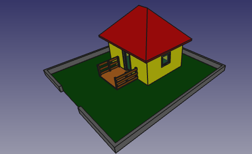

and should finnaly end up here

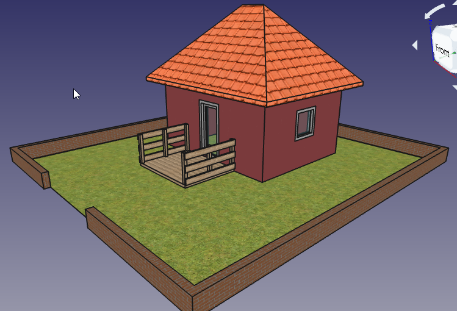
    </summary>

**The workbench works with FreeCAD 0.18 Python 3 and Python 2 builds. It might also work with older versions but is not tested so far**

1. At first download and open the "House.FCStd" file located under "Resources/Documentation" in the repository. Or start with whatever arch project you want. Now you should see this building in the 3D View


2. Next switch to the Arch Texture Workbench and click the "Create TextureConfig" icon

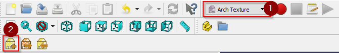

3. Now the object should be visible in the TreeView. TextureConfigs are hidden by default when we create them and when the document loads. This is done to prevent excessive loading times on startup.

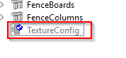

4. Now lets start texturing. Double click the TextureConfig object to display the task panel to set up some textures. After clicking the "Add Material" button, you should see something like this

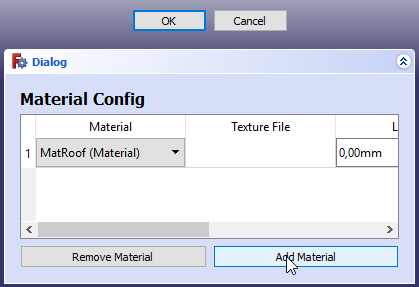

5. Select ```MatBricks``` in the Material Combo Box and click the "..." button next to the "Texture" input field. Select a brick texture from your file system (I used textures from https://www.textures.com/). After you click "OK" nothing will happen because the TextureConfig is still hidden.

6. Select the TextureConfig in the Tree View and hit the "Space" key. This will add the texture in our config to all objects with the "MatBricks" materials. When hiding the TextureConfig again, the textures will be removed from the 3D View. When the textures are visible you should see something like this

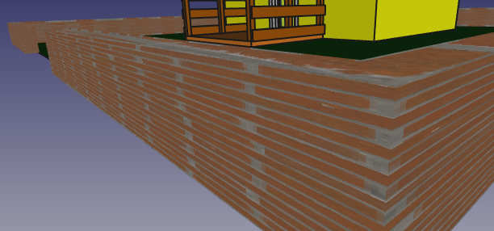

But wait! This does not really look like a brick wall at all. The texture is stretched pretty badly. But this is easy to fix.

7. Double click the TextureConfig again and add the real size of the texture. The bricks texture I used is about 1200x1200 mm in size. If the size of the texture is not given, simply google the size of a single brick and multiply it with the number of bricks in your texture.

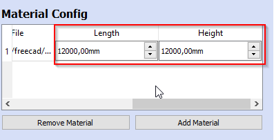

8. Click "OK" and check the 3D View again. Now it looks much more like a real brick wall.

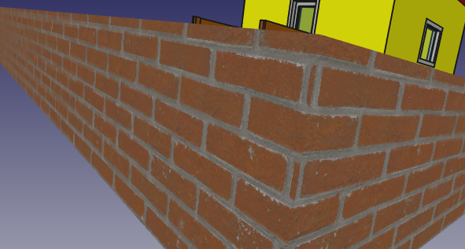

9. Repeat the above steps for all other materials and you should end up with something like this


10. Most of the textures look good. But it might be, that the roof does not look like expected. The texture should be mapped so that the lines run horizontally but they run oblique across the faces.

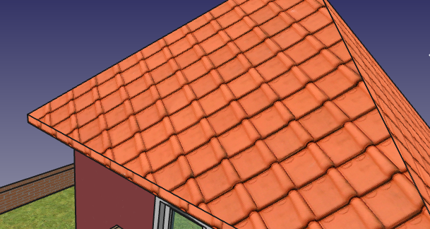

But this is pretty easy to fix. Select the TextureConfig in the TreeView and click the "Configure Faces" button.

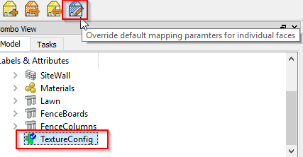

Now enter the angle in degrees you want to rotate a certain face. Positive values rotate the texture clockwise and negative values counter clockwise. For our roof a rotation of 55 degrees for the front and back faces and -55 degrees for the side faces should work pretty well. Now select the faces you want to set the rotation for and click "Apply". The rotation is applied immediately. You have to unselect the faces to see the rotated texture.

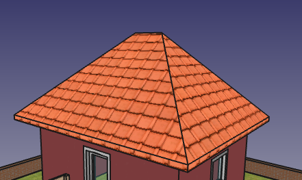
</details>

## Troubleshooting

When something happens and you end up with broken textures or a broken 3D View (e.g. you deleted the TextureConfig before hiding it) you can always close the document and reopen it. The TextureConfig is hidden by default and no textures will be shown after a reload.

## Texture mapping

When mapping the texture to a face the algorithm works as follows:

 1. When the real size is set and the texture is not quadratic, the algorithm maps the longest side of the texture to the longest side of the face
 2. When the real size is not set or the texture is quadratic, the algorithm maps the "s" side of the texture to the longest side of the face
 3. When a override is set for a face, and the override has a rotation other the 0, this rotation will be used to rotate the texture on this face

The following image formats are supported:
 - xwd
 - tiff
 - tga
 - png
 - pic
 - jpeg
 - JPEG-2000
 - gif
 - rgb
 - eps

## Bump mapping

Bump mapping is a technique to add a lot more details to an object without actually modelling it. It is best explained with an example.

Lets say we have a simple wall with a brick texture applied
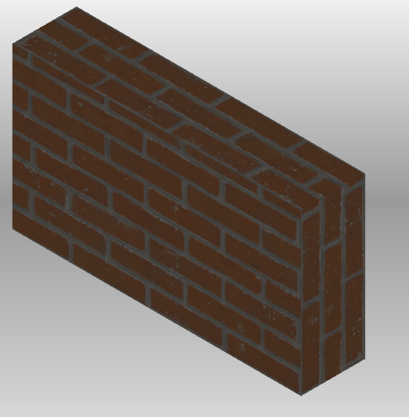

The wall looks a bit flat. Normally there are bumps in the bricks and shadows in the gaps. Modelling this small details will need a long time to finish and will increase rendering time a lot.
But with bump mapping we get a lot of details nearly for free. This is the same object with the same texture but an additional normal map applied.

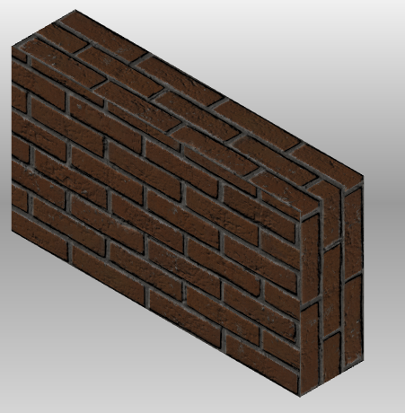

This looks a lot more realistic.

There are two types of bump maps available:
 - **Height Map**: This is a simple greyscale texture that contains height information per pixel. The darker the pixel, the deeper inside the surface it is.
 - **Normal Map**: A normal map is a blueish type of texture. This map looks more realistic than a height map as it contains more information than a height map. The color of each pixel defines the normal vector for this part of the surface. So light calculation could be a lot more accurate.

 To enable bump mapping, simply select a bump map texture file for a given material. Bump mapping only works in combination with a texture. When you select a bump map only, nothing will be displayed at all.

## Environment Textures
<details>
    <summary>
When you have done some texturing and want to show off your work, the simplest way would be to create a screenshot inside freecad. You position your camera perfectly and take a shot.

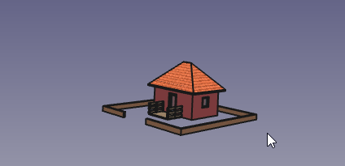

Not that exiting. The default background migt work when building a cloud-castle ;). But for buildings on earth some natural background would be way better. Then environment config exactly does this.

With the right config you can enhance your screenshots a lot and get something like this:

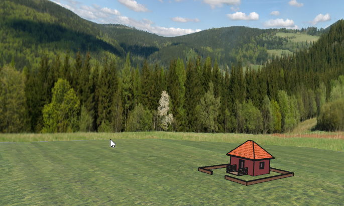

Read more...
    </summary>

To create a new EnvironmentConfig you click the "Create EnvironmentConfig" command.


This will create a new EnvironmentConfig object in the TreeView with some default settings applied. You can show and hide a EnvironmentConfig object like other objects in FreeCAD.

You might notice, that event though the object is visible, nothing is shown in the 3D view. This is because no textures are configured yet. Only when a texture is configured for a given part of the environment, this part will be displayed.

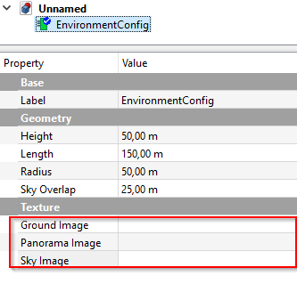

To understand the geometry properties a bit better take a look at this picture

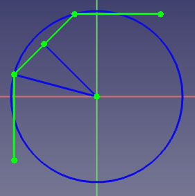

The green line is the geometry that displays the panorama image, as seen from top view.

When ```PanoramaType``` is set to ```Thirds``` the full image will be distributed evenly across the three planes. 

When ```PanoramaType``` is set to ```360``` you can imagine the full image to be mapped to the blue circle. And only the part that maps to the green planes is displayed. So when you rotate the environment config the visible panorama also changes. The beginning of the image is considered "North" and is always fixed to the positive Y axis.

### Ground Image
This is the image that should be displayed on the ground plane. This should be a quadratic image as the ground plane is also quadratic. The size of the ground plane is calculated according to the radius and length properties.

### Panorama Image
This image is displayed on the green line in the above picture. You can define the length and height of this plane with the properties of the same name.

### Sky Image
This is the image that is displayed above the panorama image as the sky. The length is the same as for the panorama Image. The height is calculated according to the sky overlap, radius and length properties.

### Panorama Type
The type of panorama image used.
 - ```Thirds```: The full image will be distributed evenly across the three planes
 - ```360```: The image will be treated as 360 degrees panorama

See the introduction for more details.

### Length
Defines the Length of the plane that shows the panorama image. The plane consists of three evenly sized faces.

### Height
Defines the height of the plane that shows the panorama image.

### Radius
This is the radius of the blue circle in the picture above. Basically this defines the distance from the origin to the panorama image plane.

### Sky Overlap
The Sky plane is positioned similar to the panorama plane. It is offset from the panorama plane by 1 meter (The blue circle will have Radius + 1m) and continues above the panorama plane in a 45 degree angle to the origin.

This property defines the distance, the sky plane should run down behind the panorama plane. This is especially useful when you have a panorama with transparency where the sky should be. Then your sky is visible where the panorama is transparent.

### Rotation
The image above displays the default placement of the environment textures. The rotation can be used to rotate the whole environment around the Z axis. You can use this to orient the environment to face your camera.

### ZOffset
This property can be used to move the environment up and down the Z-Axis. This is useful to have the ground plane displayed below your geometry.
By default this property is set to -1mm so that it is below all geometry on the origin plane.

</details>

## Technical details
<details>
    <summary>
    This section gives some insight on the technical part of the workbench. This is mainly some documentation for me so that I still know in a year or two what's going on in this workbench. But maybe some aspects could be interesting for others too.
    </summary>

First, it is relative easy to add textures to objects in FreeCAD. Found this forum thread (https://forum.freecadweb.org/viewtopic.php?f=38&t=7216) that shows, adding a texture is only 3 lines of code. But mapping textures right on to an object involves a bit more code.

### General steps to map textures
1. Create a SoTexture2 object and set the ```filename``` to a image file
3. Create a SoTextureCoordinate2 object and set the points array to map the vertex coordinates of the geometry
4. Add both to the rootNode of your object and the texture should show up

### TextureConfig
The texture config holds all the information about materials and the textures to apply to them. When displayed the textures will be added to the objects, when hidden the textures are removed.

### TextureManager
The texture manager does the heavy lifting. It keeps track of all textures and the textured objects and can add/remove textures to/from objects.

When texturing objects the texture manager looks for arch objects with a material assigned. When the material is found in the texture config it will use the settings to texture the object.

The texturing process is as follows:
1. We get the RootNode of the object
2. We search for the Coordinate3 node in the RootNode. This node contains a list of all vertices our object consists.
3. We search for the SoBrepFaceSet in the RootNode. This is the object that contains the face information
    - This object has a list of vertex indices that map to the vertices in the Coordinate3 object
    - It also has a list of faces. This describe the number of triangles that form a face of the object.
    - It also contains a textureCoordinate field that works like the coordinate indices but for textures. **This should normally be the same as the coord index field or it should be empty** But FreeCAD sets it to -1. So we have to override it with the coordIndex field to get correct textures.
4. Based on the FaceSet and the Coordinate3 object we calculate the vertices that make up each face.
    - We group the vertex indices by triangles. Each triangle is separated by a ```-1```.
    - Then we use the partIndex field to get the number of triangles per face and build the face list from this information
5. When we have the faces of our object we need to calculate the texture coordinates for this face. See ```Calculating texture coordinates``` for further details.
6. When we have all the information we need, we simply add the required nodes to the scene graph and the textures show up.

### Calculating texture coordinates
This is the trickiest part in the process. The basic idea is pretty simple:

1. Move each face to the origin
2. Rotate each face that is maps the XZ plane
3. Move each face so that it is in the positive X and Z quadrant
4. Calculate the bounding box for the face
5. Map the image to match the bounding box

#### 1. Move each face to the origin
This is pretty straight forward. As we know the first three vertices of our face always form a triangle, we use the first one as our offset and subtract it from each vertex in the face. So the first vertex matches the origin and the others, moved by the same amount, still form our original face

#### 2. Rotate each faceso it maps the XZ plane
This was pretty tricky to figure out (At least for me as I'm not a specialist in Matrix transformations and so on).

The general idea behind it is:
1. Calculate the local coordinate system for our face
2. Create a matrix that transforms our local coordinate system to the global one
3. Multiply each vertex with the matrix

Calculate the local coordinate system:
 - We make use of the fact, that the first three vertices for a triangle. This triangle is our local coordinate system.
 - The Y-Axis maps to the triangles normal vector. This ensures, that the normal will face the Front plane later on as this is also the Y axis in the global coordinate system.
 - The X-Axis is the shortest line starting from the first vector. This ensures that we don't use the diagonal of the triangle as our axis. Else the face would be twisted in the front plane.
 - The Z-Axis is simply the cross product of the other two axis

Calculate the matrix:
 - First we normalize our local coordinate system. Otherwise we would scale our face when mapping it to the front plane
 - Then the rotation matrix is simply a dot product of the normalized local axis and the global axis
```python
FreeCAD.Matrix(normalizedX.dot(globalX), normalizedX.dot(globalY), normalizedX.dot(globalZ), 0,
    normalizedY.dot(globalX), normalizedY.dot(globalY), normalizedY.dot(globalZ), 0,
    normalizedZ.dot(globalX), normalizedZ.dot(globalY), normalizedZ.dot(globalZ), 0,
    0, 0, 0, 1)
```

#### 3. Move each face so that it is in the positive X and Z quadrant
Now we can end up with faces that have vertices with a negative Z or X value. We want them all to be positive so that we can use this information later on and simply use our bounding box to calculate the texture coordinates.

To do so we check the Minimum X and minimum Z values of our face. If one is less than 0 we transform all vertices in the face by this amount in the positive direction. Now the smallest values will be 0 and everything else should be in the positive axis.

#### 4. Calculate the bounding box for the face
Now that everything is in the positive XZ plane we can simply use the smallest XYZ and biggest XYZ values to form our bounding box.

#### 5. Map the image to match the bounding box
Basically the image should map our bounding box. That means the lower left corner of the image maps to the lower left corner of our bounding box (XMin, YMin, ZMin) and the upper right corner of the image maps to the upper right corner of our bounding box (XMax, YMax, ZMax).

When the user sets the ```realSize``` property of the texture config, we use this informatoins to calculate a scale for the image first. Lets say the face is 2x2 meters in size. And the image has a real size of 1x1 meters. Than we have to repeat the texture 2 times in each direction to get it scaled right.

After we know how big the image should be we simply calculate each vertex coordinate relative to the bounding box. Lets say we have a vertex in the middle of our image. It should map to the 0.5/0.5 coordinates of the image.

</details>

## Support
Found a bug? Have a nice feature request? simply create an issue in this repository or post to this FreeCAD Forum threads:

Bugs/Help Requests: https://forum.freecadweb.org/viewtopic.php?f=3&t=38222
New Features: https://forum.freecadweb.org/viewtopic.php?f=10&t=38223
